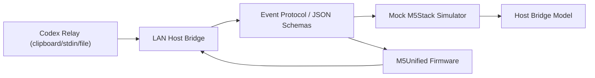

# アーキテクチャ

## Responsibility

| Layer | Responsibility | File |
| --- | --- | --- |
| Host adapter | pairing、token 検証、event 配信、device event 受信 | `src/host-adapter/localLanBridge.mjs` |
| LAN Host Bridge | HTTP API、sample replay、event log、WebSocket upgrade | `src/host-bridge/server.mjs` |
| Codex relay | clipboard / stdin / file の返答本文を event 化する | `src/codex-adapter/relay.mjs` |
| Codex adapter model | Codex 側の未確定差分を隔離する mock | `src/host-adapter/mockCodexAdapter.mjs` |
| Protocol | schema load、型検査、warning | `src/protocol/validator.mjs` |
| Device adapter | Core2 / GRAY の入力と画面差分 | `src/device-adapter/deviceProfiles.mjs` |
| Simulator | device screen state、scroll、reply、interaction | `src/simulator/mockDevice.mjs` |
| Firmware | Wi-Fi、pairing、polling、screen state、button / touch input | `firmware/src/main.cpp` |
| Release guard | QCDS、manual cap、release evidence | `tools/closed-alpha-guard.mjs` |

## Data Flow

1. Codex relay が clipboard / stdin / file から返答本文を受け取る。
2. Host Bridge が device を pairing し token を発行する。
3. Host -> Device event は schema validation 後に queue され、firmware が polling で取得する。
4. Device -> Host event は token 検証後に reply / interaction / heartbeat として受理する。
5. 通知本文と回答本文は device 永続保存せず、画面状態だけを保持する。

## Reversibility

MQTT、BLE、公開 Codex adapter API は transport / adapter として追加できるように分けています。closed alpha は HTTP polling と Codex relay を既定にし、WebSocket upgrade は将来 transport の検証用に残します。
