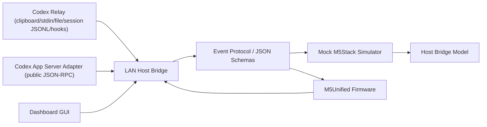

# アーキテクチャ

## Responsibility

| Layer | Responsibility | File |
| --- | --- | --- |
| Host adapter | pairing、token 検証、event 配信、device event 受信、long press から Choice request への side effect | `src/host-adapter/localLanBridge.mjs` |
| LAN Host Bridge | HTTP API、sample replay、event log、queue/log 上限、stale diagnostics、WebSocket upgrade | `src/host-bridge/server.mjs` |
| Dashboard GUI | 状態確認、debug snapshot、runtime status、event 送信、Decision 返信確認、最新 Codex session 回答表示、現在 pet preview、Core2 / button reference preview、表示倍率 / RGBA / beep 調整、環境構築 command modal と allowlist command 実行 | `src/host-bridge/dashboard/` |
| Codex relay | clipboard / stdin / file の返答本文を event 化する | `src/codex-adapter/relay.mjs` |
| Codex session watcher | local session JSONL の最新 user / assistant やり取りを event 化する | `src/codex-adapter/sessionWatcher.mjs` |
| Codex hook relay | Codex Hooks から one-shot relay を実行する | `src/codex-adapter/hookRelay.mjs` |
| Codex app-server adapter | Codex App Server public interface の JSON-RPC message builder、transport gate、runtime probe | `src/codex-adapter/appServerAdapter.mjs`、`tools/codex-app-server-runtime-probe.mjs` |
| Adapter review | fallback adapter、public API workstream、private scraping 禁止を検証する | `src/codex-adapter/adapterRegistry.mjs` |
| Codex adapter model | Codex 側の未確定差分を隔離する mock | `src/host-adapter/mockCodexAdapter.mjs` |
| Protocol | schema load、型検査、warning | `src/protocol/validator.mjs` |
| Pet mood model | pet state と表情 mood の正規化、fallback 導出 | `src/core/pet-mood.mjs` |
| Device adapter | Core2 release profile と button reference preview の入力と画面差分 | `src/device-adapter/deviceProfiles.mjs` |
| Simulator | device screen state、scroll、reply、interaction | `src/simulator/mockDevice.mjs` |
| Firmware | Wi-Fi、pairing、polling、backoff、screen state、button / touch input | `firmware/src/main.cpp` |
| Installer signing | WiX/MSIX template、Windows SDK / WiX / 署名 env readiness | `installer/`、`tools/windows-signing-check.mjs` |
| Release guard | QCDS、manual cap、release evidence | `tools/release-guard.mjs` |

## Data Flow

1. Codex relay、Codex Hooks、Codex App Server adapter、または Dashboard GUI が clipboard / stdin / file / local session JSONL / form input から event を生成する。
2. Host Bridge が device を pairing し token を発行する。
3. Host -> Device event は schema validation 後に queue され、firmware が polling で取得する。
4. Device -> Host event は token 検証後に reply / interaction / heartbeat として受理する。
5. Dashboard は `/events` と `/debug/snapshot` で redacted log を表示し、ABC 返信の `choiceId` と input を確認する。
6. Dashboard は `/codex/session/latest` で local session の最新 assistant 回答を表示し、`/codex/session/publish` で M5Stack へ送信する。
7. Dashboard は `/pet/packages`、`/pet/current/manifest`、`/pet/current/spritesheet.webp` で local hatch-pet キャラを preview し、`/codex/display` で pet 表示倍率、pet X/Y offset、text size、render FPS、motion step、screen / pet / text / border RGBA、text border 表示、answer beep を `display.settings_updated` として送る。
8. Dashboard は `/debug/runtime` で Bridge のforeground / background状態を表示し、`/debug/commands/run` で localhost から allowlist された環境構築 / debug command だけを実行する。
9. Dashboard または `codex:decision` は Codex 側から M5Stack へ三択判断を求め、A/B/C の返信を inbound event として受ける。
10. M5Stack の pet long press / button long press は `device.pet_interacted` として Host Bridge へ返り、Host Bridge が同一 device に `prompt.choice_requested` を queue する。
11. 通知本文と回答本文は device 永続保存せず、画面状態だけを保持する。
12. Adapter review と signing readiness は `docs/*.json` と `dist/*.json` に本文や秘密を含まない証跡だけを残す。

## Reversibility

MQTT、BLE、公開 Codex App Server 連携は transport / adapter として追加できるように分けています。beta は HTTP polling と Codex relay を既定にし、Codex App Server adapter は public JSON-RPC の準備済み経路として扱います。GRAY 実機と GRAY IMU は復帰対象にせず、新しい実機対象が必要な場合は別 profile として追加します。
