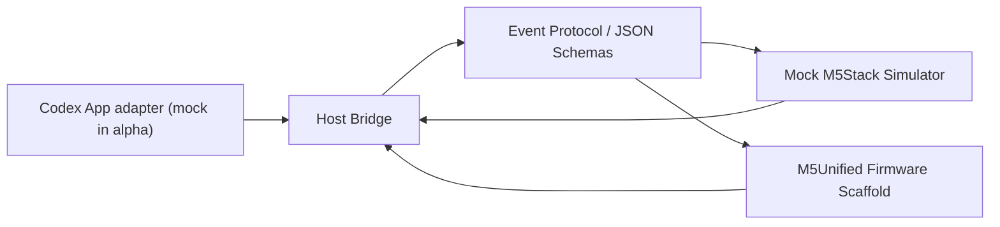

# アーキテクチャ

## Responsibility

| Layer | Responsibility | File |
| --- | --- | --- |
| Host adapter | pairing、token 検証、event 配信、device event 受信 | `src/host-adapter/localLanBridge.mjs` |
| Codex adapter | Codex 側の未確定差分を隔離する mock | `src/host-adapter/mockCodexAdapter.mjs` |
| Protocol | schema load、型検査、warning | `src/protocol/validator.mjs` |
| Device adapter | Core2 / GRAY の入力と画面差分 | `src/device-adapter/deviceProfiles.mjs` |
| Simulator | device screen state、scroll、reply、interaction | `src/simulator/mockDevice.mjs` |
| Release guard | QCDS、manual cap、release evidence | `tools/closed-alpha-guard.mjs` |

## Data Flow

1. Host Bridge が device を pairing し token を発行する。
2. Host -> Device event は schema validation 後に simulator / firmware へ渡す。
3. Device -> Host event は token 検証後に reply / interaction / heartbeat として受理する。
4. 通知本文と回答本文は device 永続保存せず、画面状態だけを保持する。

## Reversibility

WebSocket、MQTT、実 Codex adapter は transport / adapter として追加できるように分けています。closed alpha では HTTP / WebSocket の実 network 実装よりも event contract と device UX の検証を優先しています。
