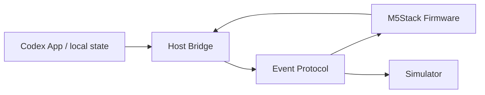

# アーキテクチャ

## Host Bridge

- Codex App側adapterを持つ。
- pet manifest adapter、notification adapter、answer adapter、choice adapterを分ける。
- WebSocket serverでdeviceへイベントを配信する。
- HTTP endpointでpairingとhealth checkを提供する。
- deviceからのreplyをCodex側adapterへ戻す。

## Firmware

- M5Unifiedを使い、Core2 / GRAY共通の描画と入力loopを持つ。
- `DeviceProfile`でtouch可否、button mapping、IMU tap可否を切り替える。
- `ScreenState`でPairing、Idle、Notification、Answer、Choice、Errorを管理する。
- `ProtocolClient`でWebSocket、reconnect、heartbeatを扱う。

## Simulator

- sample payloadを読み込み、device screen stateを再現する。
- reply eventをhost logへ送る。
- 実機がない段階のplatform runtime gateとして使う。

## Security Boundary

- Host BridgeはLAN bindを初期値にし、外部公開しない。
- 初回pairing後のtokenなしdevice eventを拒否する。
- device側は本文を永続保存しない。
- pet spriteはhostが一時変換し、公開配布用assetへ混ぜない。
